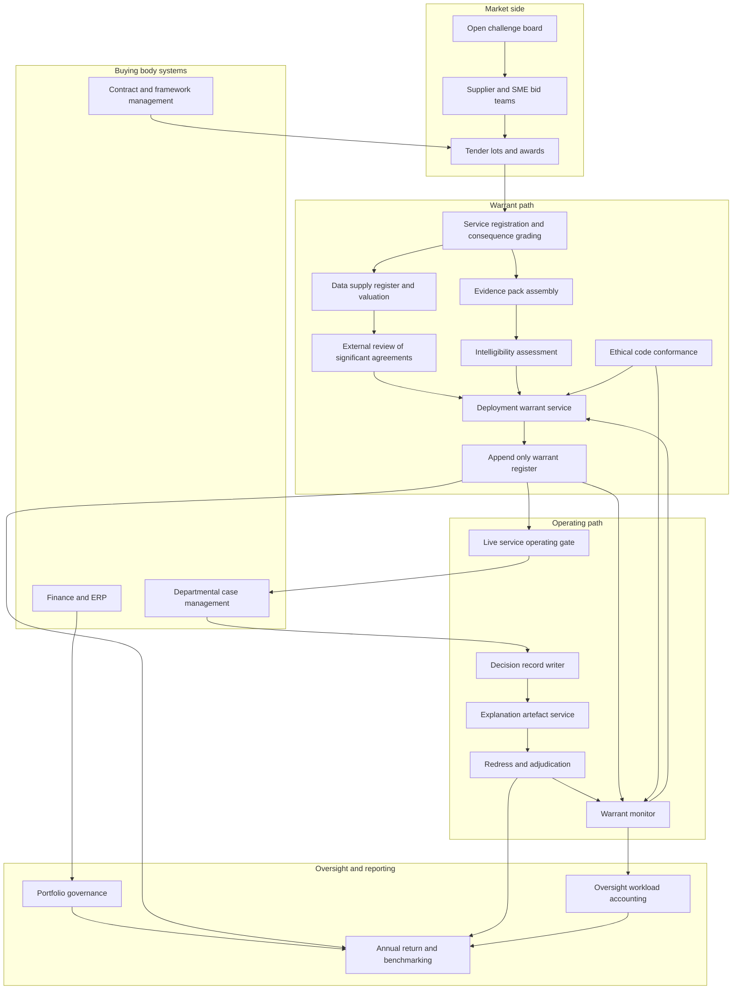

# Assentia

**Source:** `ai-in-gov/ai-in-the-UK-ReadyWillingAndAble-April-2018/`
**Domain:** `ai-gov`
**One-liner:** A deployment-warrant system for public bodies that lets a department run an ai-assisted decision service only while it can evidence explainability, fair market access, recorded data value and a live redress route — and that suspends live operation when it cannot.
**Wedge:** UK central-government departments, arm's-length bodies and NHS foundation trusts procuring ai-assisted casework, triage and eligibility decisioning at £250k–£10m contract value, where the decision materially affects an identifiable individual and appeal, ombudsman or judicial-review exposure is real.
**Positioning:** Public-sector AI deployment assurance. Existing digital-marketplace and GovTech tooling optimises for buying speed and supplier onboarding; Assentia treats the *permission to operate* as the product — a named, time-boxed, revocable warrant tied to an evidence file that survives internal audit, a value-for-money review, a freedom-of-information request and an appeal.

## Market research synthesis

### Thesis from source

The source is the report of the House of Lords Select Committee on Artificial Intelligence, appointed on 29 June 2017 "to consider the economic, ethical and social implications of advances in artificial intelligence", ordered to be printed 13 March 2018 and published as HL Paper 100 on 16 April 2018. Its conclusion is optimistic about capability — the UK "is in a strong position to be among the world leaders in the development of artificial intelligence" — and almost entirely institutional about what is missing. Of the seventy-four conclusions and recommendations, the great majority are addressed not to technologists but to named organs of state: the Government Office for AI, the AI Council, the Centre for Data Ethics and Innovation, the Alan Turing Institute, the Crown Commercial Service, the Government Digital Service, the Information Commissioner's Office, the Competition and Markets Authority, the Law Commission, the National Audit Office, NHS Digital and the National Data Guardian. Appendix 9 goes as far as tabulating which organisation should lead on which recommendation. The document's real subject is the machinery of delivery.

Two of its strands, read together, describe a product. The first is a hard deployment condition. At paragraph 105 the Committee states that "it is not acceptable to deploy any artificial intelligence system which could have a substantial impact on an individual's life, unless it can generate a full and satisfactory explanation for the decisions it will take", and adds that where deep neural networks cannot yet do so, deployment for those uses may have to be delayed until alternatives are found. Paragraph 99 goes further for safety-critical domains: regulators there "must have the power to mandate the use of more transparent forms of AI, even at the potential expense of power and accuracy". Paragraph 368 completes the loop by observing that it must be clear to the public "who to turn to if there are any complaints about how AI has been used", beyond the data-use matters already inside the Information Commissioner's remit. Explainability, in other words, is not framed as a research aspiration but as a precondition of operating and a precondition of contest.

The second strand is procurement. Paragraph 216 recommends that public procurement regulations be reviewed and amended so that UK-based companies offering AI solutions "are invited to tender and given the greatest opportunity to participate", with the Crown Commercial Service and the Government Digital Office reviewing the Government Service Design Manual and the Technology Code of Practice so that such procurement is "encouraged and incentivised, and done in an ethical manner". Paragraph 217 asks government to be bold, funding speculative prototypes on the explicit reasoning that "the value of AI systems which are deployed to the taxpayer will compensate for any money lost in supporting the development of other tools" — a portfolio argument, not a project argument. Paragraph 218 recommends an online bulletin board advertising challenges identified across government by the Government Office for AI and the GovTech Catalyst. The Committee's own SME roundtable at techUK on 7 December 2017 records the supplier-side view of the same problem: attendees thought government procurement "could be a major boost to AI start-ups in the UK if government departments could be encouraged to look to UK companies first", wanted to be invited to Whitehall more often, and said that what was needed was action "and an understanding of who, exactly, would be held accountable for their execution".

The third strand supplies the commercial teeth. The Committee is blunt that public data has value and that public bodies are giving it away without knowing what they hold. Paragraph 301 warns that "the current piecemeal approach taken by NHS Trusts, whereby local deals are struck between AI developers and hospitals, risks the inadvertent under-appreciation of the data" and exposes trusts to inadequate sharing arrangements; paragraph 300 insists there must be no repeat of the controversy between the Royal Free London NHS Foundation Trust and DeepMind. Paragraph 88 recommends that the Information Commissioner's Office help public-sector data controllers "estimate the value of the data they hold, in order to make best use of it and negotiate fair and evidence-based agreements with private-sector partners", and — the operative clause — that the ICO "should have powers to review the terms of significant data supply agreements being contemplated by public bodies". Paragraph 302 asks NHS England and the National Data Guardian to publish a data-sharing framework by the end of 2018 covering anonymisation, precautions, data value, SME access and patient opt-out, drawing on the Caldicott Guardians and on trusts with prior experience such as Royal Free London and Moorfields Eye Hospital; paragraph 303 asks the NHS to digitise records in consistent formats by 2022. Paragraph 85 offers the access pattern the Committee prefers: Transport for London's single point of access, with terms, conditions and privacy controls attached.

Finally, the report supplies the conformance instrument and the reporting cadence. Paragraph 417 sets out five principles for an AI Code — development for the common good, intelligibility and fairness, no diminution of data rights or privacy, a right to education to flourish alongside AI, and never vesting autonomous power to hurt, destroy or deceive in AI. Paragraph 418 proposes that a body such as the Centre for Data Ethics and Innovation oversee adherence and, "in more extreme cases", consider withdrawing the seal of approval. Paragraph 391 asks that progress against the report's recommendations and the Government's AI policies "be reported on an annual basis to Parliament" and be "benchmarked and tracked against appropriate international comparators"; paragraph 369 asks that the work programmes of the new AI institutions be agreed with one another quarterly and be "publicly available for scrutiny". A revocable seal, a graded explainability duty, an evidenced data valuation, a published pre-tender challenge, an annual return to a legislature: those are the components of an operating licence for public-sector AI, and no single system holds them today.

### Buyer & economic model

- **Primary buyer:** the Chief Digital and Information Officer of a ministerial department or arm's-length body, co-sponsored by the Commercial Director; in the health case, an NHS trust's Chief Information Officer with the Caldicott Guardian as the effective gatekeeper. The accounting officer is the person whose personal accountability the product protects.
- **Users:** service owners running the affected casework line (daily), commercial and category managers running lots and awards (per procurement), data protection officers and Caldicott Guardians (per evidence pack and per data supply agreement), redress and complaints caseworkers (daily), internal audit and value-for-money reviewers (per review cycle), and departmental ethics or advisory board members (per warrant decision).
- **Budget owner / value metric:** the digital and commercial change budget inside a departmental spending settlement. The value metric is the share of live ai-assisted decision services holding a current warrant with a complete evidence file, and the fall in decisions overturned on appeal for want of an explanation. Secondary metrics are SME share of awarded AI lots by value, and the recorded value of public data supplied to suppliers versus the consideration received.
- **Competing status quo:** a Data Protection Impact Assessment in a document, an equality impact assessment in another, a contract milestone spreadsheet, a framework call-off through an existing digital marketplace, and one internal audit sample a year — with the explanation for any contested decision reconstructed by hand from supplier logs after a complaint or a freedom-of-information request lands. Nothing in that stack can stop a service operating, and nothing in it prices the data going out of the door.

### Domain constraints

- **Regulatory / trust / safety:** the automated-decision and information provisions of the Data Protection Act and GDPR, which the Committee notes "appear to address many of the concerns of our witnesses"; the public-sector equality duty; freedom-of-information duties, which make the evidence file itself potentially disclosable and therefore require it to be written for disclosure; judicial review of decisions taken or prepared by automated means; competitive-tendering rules that constrain how far a domestic-supplier preference can be expressed, which the Committee's SME roundtable identified explicitly; and value-for-money scrutiny by the National Audit Office and Public Accounts Committee. Sector regulators remain the primary regulators — the Committee is clear that "blanket ai-specific regulation, at this stage, would be inappropriate" — and paragraph 387 asks for NAO advice to ensure those regulators, the ICO in particular, are "adequately and sustainably resourced".
- **Data sensitivity:** patient-level records governed by the Caldicott principles with a named Guardian and a patient opt-out; benefits, immigration and criminal-justice casework data where a wrong decision is a serious individual harm; and supplier model documentation that is commercially confidential and cannot be published, yet must be reviewable by an oversight body and sufficient to ground a citizen-facing explanation. Explanations must therefore be constructed to be contestable without disclosing either another individual's personal data or the supplier's trade secrets.
- **Change-management realities:** annual appropriation and multi-year spending-review cycles mean a warrant cannot silently depend on funding that lapses at year end; machinery-of-government changes move services between departments mid-contract and orphan their accountable owners; general elections reset ministerial priorities while the Committee's requested annual report to Parliament assumes a stable baseline and stable definitions. Departments will not replace their case management systems to gain assurance, so the product must sit alongside them. And the supplier community's stated complaint is not process but ownership — they want to know who is accountable, which means the warrant must carry a person's name, not a team's.

## Business requirements

- BR-1: No ai-assisted service that materially affects an identifiable individual may enter or remain in live operation without a current deployment warrant, and a warrant must be refused where the service cannot produce a full and satisfactory explanation for the decisions it takes.
- BR-2: Explainability obligations must be graded by decision consequence rather than applied uniformly, and services in safety-critical domains must be capable of being required to use a more transparent method even where that measurably reduces accuracy.
- BR-3: Every warrant must name one accountable senior owner inside the buying body; where that owner leaves or the service transfers between departments, the warrant must be revalidated rather than inherited silently.
- BR-4: Warrants must be time-boxed and revocable, so that expiry, an evidence gap, or loss of ethical-code conformance suspends live operation automatically rather than opening a discretionary negotiation.
- BR-5: Every public-sector problem intended for an ai-based solution must be published on an open challenge board before tender, and the platform must report SME share of invited, bidding and awarded lots by both count and contract value.
- BR-6: Speculative and prototype spend must be governed as a declared portfolio with a stated tolerance for individual failure, and reported on aggregate value so that a single unsuccessful prototype is not treated as a control failure.
- BR-7: No public dataset may be supplied to a supplier before the buying body has recorded an evidence-based valuation of that data and the terms on which value returns to the public; supply without a recorded valuation must be blocked, not flagged.
- BR-8: Significant data supply agreements must be reviewable by an external oversight body before signature, and the review outcome must be part of the warrant evidence.
- BR-9: Any person subject to an ai-assisted decision must be able to obtain the explanation and open a challenge through one published route, and the body must resolve or escalate that challenge within a stated period, with the outcome recorded against the service.
- BR-10: The evidence behind every warrant must be complete enough to satisfy an external audit and a freedom-of-information request without reconstruction, and must preserve the model version, data sources and rules in force at the moment of each individual decision.
- BR-11: Conformance with a published cross-sector ethical code, including recognised sector variants, must be a condition of warrant, and withdrawal of the code seal must withdraw the warrant with it.
- BR-12: Portfolio progress must be reportable annually to the legislature on stable year-to-year definitions and benchmarkable against comparable jurisdictions, and the assurance and regulatory workload the portfolio creates must be measured and published alongside it.

## User stories

Canonical user stories live in sibling [USER_STORIES.md](USER_STORIES.md).

## System design

### Overview

Assentia runs two paths that meet in the decision record. The **warrant path** is deliberate and slow: a buying body publishes a challenge to an open board, runs lots and records awards with SME participation captured; registers the intended AI service and its consequence grade; assembles an evidence pack of impact, equality and lawful-basis assessments plus the supplier's model description; submits the service for an intelligibility assessment against the standard for its grade; registers and values any public dataset it intends to supply and, where the agreement is significant, refers it for external review; attaches its ethical-code conformance; and receives a named, time-boxed, revocable deployment warrant. The **operating path** is fast and continuous: each decision the live service takes writes a decision record and an explanation artefact bound to the exact model version, data sources and rules then in force; citizens obtain that explanation and open redress cases through one route; overturns, evidence expiry, valuation gaps and code-seal withdrawal feed a warrant monitor that can suspend live operation. Portfolio and annual reporting sit across both, aggregating speculative spend, SME access, redress outcomes and oversight workload into the return that goes to the legislature.

### Actors & boundaries

- **Actors:** the buying body (service owner, category manager, data protection officer or Caldicott Guardian, redress caseworker, assurance lead, accounting officer), the supplier, the sector regulator, the ethical-code overseer, the external data-agreement reviewer, the national audit body, and the citizen who is the subject of the decision and the beneficiary of the redress route.
- **Trust boundary:** the warrant register is the neutral record. Supplier model internals stay inside the supplier's boundary; what crosses is an attested model description, a version identifier, and per-decision explanation artefacts. Citizen-facing explanations are generated to be contestable while excluding other individuals' personal data and the supplier's commercially confidential detail. Neither the buying body nor the supplier can retrospectively amend a decision record or an issued warrant; corrections are appended.
- **Human-in-the-loop points:** consequence grading of a service; intelligibility assessment sign-off; data valuation approval and external review of significant agreements; warrant issue, renewal and suspension; redress adjudication and overturn recording; portfolio failure-tolerance setting.

### Core capabilities

1. **Challenge publication and market signalling** — an open, pre-tender board of public-sector problems open to ai-based solutions, with the identifying body, the affected service and the intended route to market.
2. **Tender fairness and SME access accounting** — lots, invitations, bids and awards recorded so that SME participation is measurable by count and by value rather than asserted.
3. **Service registration and consequence grading** — classification of each ai-assisted service by the severity of its effect on an individual, which sets the explanation standard and whether a transparent-method requirement can be imposed.
4. **Evidence pack assembly** — versioned impact, equality and lawful-basis assessments plus supplier model description, held as the disclosable file behind the warrant.
5. **Intelligibility assessment** — assessment of whether the service can generate a full and satisfactory explanation at its grade, with an explicit outcome of pass, conditional or delay-deployment.
6. **Public data valuation and supply register** — a register of every dataset supplied to a supplier, its valuation basis, the consideration and value-return terms, opt-out treatment, and the outcome of any external review.
7. **Deployment warrant lifecycle** — issue, renewal, revalidation on owner or department change, and suspension, with named accountability and hard expiry.
8. **Decision record and explanation service** — per-decision records bound to model version and inputs, with citizen-retrievable explanation artefacts.
9. **Redress and adjudication** — a single published challenge route with time boxes, escalation, and overturn recording that feeds back onto the warrant.
10. **Portfolio governance** — speculative and prototype investments held with a declared failure tolerance and reported on aggregate outcome.
11. **Code conformance tracking** — the ethical-code seal, its sector variant, its currency, and the operational consequence of its withdrawal.
12. **Annual return, benchmarking and oversight-workload accounting** — a stable-definition return for the legislature with named comparator jurisdictions and a published count of the assurance and regulatory effort the portfolio consumed.

### Conceptual data

- **Primary entities:** BuyingBody, PublicChallenge, TenderLot, LotAward, SupplierProfile, AiService, EvidencePack, IntelligibilityAssessment, DeploymentWarrant, DataSupplyAgreement, DataValuation, DecisionRecord, ExplanationArtifact, RedressCase, CodeConformance, PortfolioInvestment, OversightWorkloadEntry, AnnualReturn.
- **Critical events:** challenge published, lot awarded, service registered and graded, evidence pack version accepted, intelligibility outcome recorded, data supply agreement registered, valuation approved, external review returned, warrant issued, warrant renewed or revalidated, warrant suspended, decision recorded, explanation retrieved by a citizen, redress case opened, decision overturned, code seal withdrawn, annual return published.
- **Retention / audit needs:** decision records and their explanation artefacts must be retained for the full statutory appeal and limitation window with an append-only history, since their whole purpose is to be produced years later in a contest. Evidence packs and warrants are retained for the audit and freedom-of-information window and must be written on the assumption of disclosure. Data supply agreements and valuations are retained for the commercial dispute and public-accounts window. Personal data inside decision records is held under the retention rule of the originating service, with explanation artefacts constructed so that the explanation survives even after the underlying personal data is minimised.

### Integrations (conceptual)

- **Systems of record:** departmental case management and casework systems (the authoritative source of the decision and its outcome), contract and framework management, finance and ERP for portfolio spend, the national opt-out and patient-consent registers in the health case, and the department's transparency and disclosure log.
- **Upstream signals:** supplier model documentation and version releases, impact-assessment and equality-assessment tooling, sector regulator registers and enforcement notices, ethical-code overseer seal status, external reviewer determinations on data supply agreements, and national audit findings.
- **Downstream actions:** a suspension signal pushed to the live service's operating gate; publication to the open challenge board and the department's transparency register; disclosure packs assembled for freedom-of-information responses; the annual return to the legislature and its comparator benchmark; and overturn statistics returned to the service owner and supplier as a contractual performance signal.

### High-level architecture

The warrant path is a durable, auditable, human-gated flow; the operating path must keep pace with live casework. Keeping them separate is what allows a suspension decision to be deliberate while the per-decision explanation record is written at case speed.

### Success metrics

- **Leading:** share of live ai-assisted services holding a current warrant with no open evidence gap; median days from challenge publication to first SME bid; proportion of services with a recorded consequence grade and a completed intelligibility assessment; proportion of data supply agreements with an approved valuation before signature; median time from a citizen's request to explanation delivery; share of prototypes governed inside a declared portfolio rather than as standalone projects.
- **Lagging:** decisions overturned on appeal for want of an adequate explanation, as a rate and as a trend; SME share of awarded AI lot value; recorded value of public data supplied versus consideration received; number of warrants suspended and the mean time from trigger to suspension; cost of assurance and regulatory oversight per live service; and the portfolio's aggregate realised value against the speculative spend it absorbed — the arithmetic the Committee asked departments to be bold enough to accept.

## OpenAPI skeleton

Canonical HTTP surface lives in sibling [openapi.yaml](openapi.yaml). Summary:

- **Base path:** `/v1/...`
- **Auth:** `X-API-Key` for system-to-system integration from case management, contract and finance systems; Bearer JWT for console operators (service owners, category managers, Caldicott Guardians, redress caseworkers, assurance leads).
- **Resource groups:** Challenges, Procurement, Assurance, Warrants, DataSupply, Decisions, Redress, Portfolio, Reporting.
