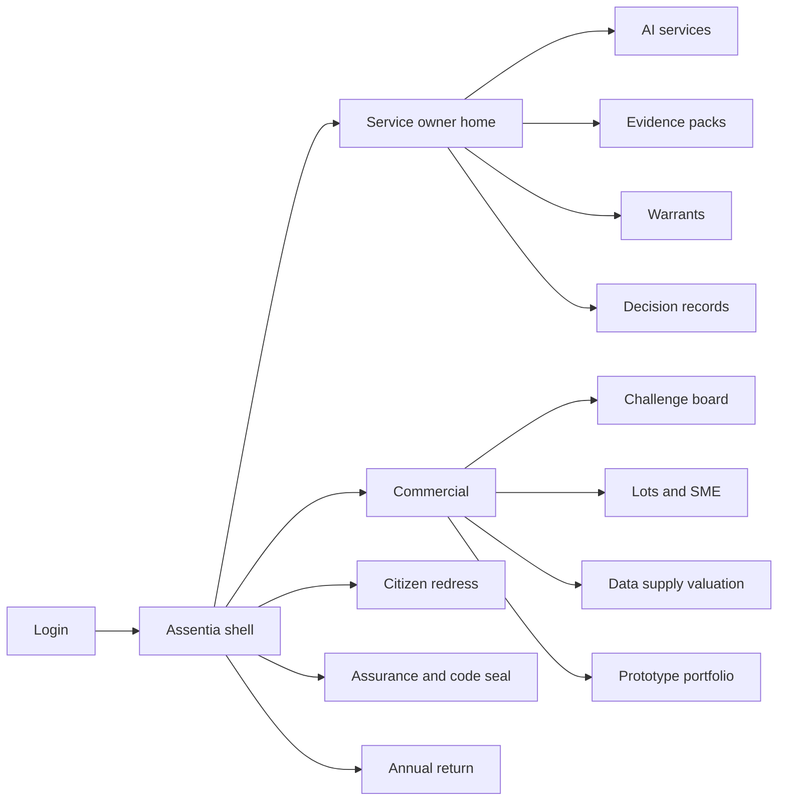
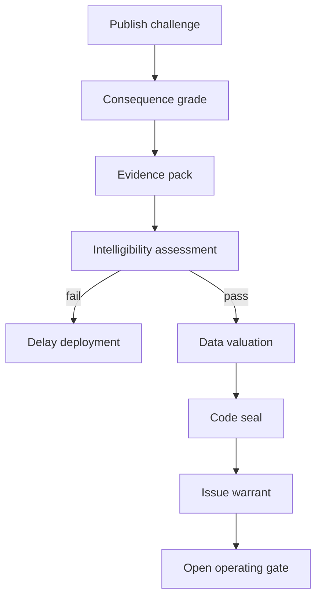

# Assentia — Web app

**Product:** [PRODUCT.md](./PRODUCT.md)
**Primary surface:** Deployment-warrant console for public-body AI decision services
**Secondary surfaces:** Open challenge board (public); citizen explanation and redress portal; annual parliamentary return pack (export)
**Design thesis:** Assentia is a revocable operating licence for AI that touches people’s lives — not a checklist that waves go-live through. The UI metaphor is a sealed warrant dossier: explainability grade, named accountable owner, valued data supply, ethical-code seal, and a live redress route must all be current, or the operating gate suspends. Visual language is Whitehall ledger — deep ink navy, paper-white evidence panels, and seal crimson only when a warrant is suspended or refused — so money and liberty decisions feel governed, not “innovated.” The Assentia wordmark sits as a quiet seal mark on every warrant and decision-explanation screen.

## UX research synthesis

### Category peers (best-in-class)

- **GOV.UK Design System / GDS service assessments:** Rigorous go-live gates and plain-language citizen journeys. Steal: assessment outcomes that can block launch; reject startup “ship fast” chrome for high-consequence decisions.
- **ICO accountability / DPIA tooling patterns:** Versioned impact assessments tied to processing. Steal: disclosable evidence packs written for FOI; reject DPIA-as-orphaned-PDF outside the operating gate.
- **Crown Commercial Service / Digital Marketplace challenge boards:** Pre-tender problem publication and supplier access. Steal: open challenge before lot shaping; reject incumbent-pre-shaped tenders as the only path.
- **NHS data-sharing / Caldicott Guardian workflows (conceptual):** Named guardianship and agreement registers. Steal: valuation + external review before supply; reject local DeepMind-style deals without a defendable file.

### Patterns to adopt / reject

- **Adopt:** Warrant as permission to operate; graded explainability by consequence; named owner with revalidation on MoG change; time-box + auto-suspend; open challenge board; SME share by value; data valuation gate before supply; single citizen redress route; append-only decision/explanation records; ethical-code seal withdrawal suspends warrant; annual return with stable definitions.
- **Reject:** Soft “ethics review” that cannot stop live service; reconstructed explanations after complaint; unvalued NHS/public data giveaways; purple AI copilots drafting legal explanations; dashboard home that hides missing evidence.

### Trust, density, and workflow constraints from PRODUCT.md

Explanations must be contestable without leaking other people’s data or supplier trade secrets (BR-1, BR-10). Warrants expire and revoke operationally (BR-4). Data supply without valuation is blocked, not flagged (BR-7). Significant agreements need external review on the evidence file (BR-8). Citizens need one published redress route with deadlines (BR-9). FOI-ready evidence means write-for-disclosure density without theatre.

## Information architecture

### Nav model

### Roles → default home

| Role | Default home | Why |
|------|--------------|-----|
| Service owner | Owner home — warrant status + evidence gaps | Plan remediation in-year (BR-1, BR-4) |
| Commercial / category manager | Challenge board + lots | SME access and pre-tender publish (BR-5, BR-6) |
| Caldicott Guardian / DPO | Data supply register | Valuation and external review gates (BR-7, BR-8) |
| Redress caseworker | Citizen challenges queue | Time-boxed contest (BR-9) |
| Assurance / audit lead | Warrant monitor + code seal | Suspension has operational effect (BR-11) |
| Accounting officer | Annual return draft | Legislature baseline (BR-12) |
| Citizen subject | Explanation + redress portal | One published route (BR-9) |

### Cross-links to OpenAPI resources

| Nav area | OpenAPI tags / resources |
|----------|---------------------------|
| Open challenges | Challenges |
| Lots, awards, SME share | Procurement |
| Intelligibility / evidence | Assurance |
| Deployment warrants | Warrants |
| Dataset valuation and agreements | DataSupply |
| Decision + explanation artefacts | Decisions |
| Citizen challenges | Redress |
| Prototype spend portfolio | Portfolio |
| Annual return / oversight workload | Reporting |

## Screen inventory

### Service owner home

- **Purpose:** Show which ai-assisted services hold current warrants and which evidence gaps threaten expiry.
- **Entry:** Service owner login.
- **Layout regions:** Brand + department switcher; warrant status strip; missing-evidence list with expiry countdowns; redress overturn rate; MoG revalidation alerts.
- **Primary actions:** Open evidence pack; request intelligibility assessment; renew warrant; suspend voluntarily.
- **Empty / loading / error:** No services = register first consequential service; suspended = coral operating-gate banner.
- **BR / story ties:** BR-1, BR-3, BR-4.

### Service registration and consequence grading

- **Purpose:** Classify decision consequence so explainability standard and transparent-method powers are clear before build.
- **Entry:** New service; pre-procurement check.
- **Layout regions:** Service definition; consequence grade selector; explanation standard preview; safety-critical flag.
- **Primary actions:** Save grade; simulate “can we meet standard?”; link challenge.
- **Empty / loading / error:** Ungraded = cannot open warrant path.
- **BR / story ties:** BR-2.

### Evidence pack workspace

- **Purpose:** Assemble disclosable DPIA, equality, lawful basis, and supplier model description versions.
- **Entry:** From service; assurance.
- **Layout regions:** Version tree; document slots; FOI-ready preview; supplier confidential annex (reviewer-only).
- **Primary actions:** Accept version; export disclosure pack; attach model version pin.
- **Empty / loading / error:** Incomplete pack = warrant refused path.
- **BR / story ties:** BR-10.

### Intelligibility assessment

- **Purpose:** Pass / conditional / delay-deployment against grade; safety-critical may mandate transparent methods.
- **Entry:** Assurance queue.
- **Layout regions:** Grade standard; assessment outcome; delay rationale; method-mandate control.
- **Primary actions:** Record outcome; require transparent method; block warrant on fail.
- **Empty / loading / error:** DNN without explanation at high grade = delay-deployment default (BR-1).
- **BR / story ties:** BR-1, BR-2.

### Deployment warrant

- **Purpose:** Named, time-boxed, revocable permission to operate with append-only history.
- **Entry:** After assessments; owner home.
- **Layout regions:** Warrant seal state; owner name; expiry; linked evidence/data/code seal; revalidation triggers; suspension log.
- **Primary actions:** Issue; renew; revalidate on owner change; suspend.
- **Empty / loading / error:** Missing owner = cannot issue (BR-3); seal withdrawal auto-suspends (BR-11).
- **BR / story ties:** BR-3, BR-4, BR-11.

### Open challenge board

- **Purpose:** Publish public-sector problems before tender so SMEs see demand early.
- **Entry:** Public + commercial nav.
- **Layout regions:** Challenge list; department; intended route to market; link to later lots.
- **Primary actions:** Publish challenge; watch; convert to lot.
- **Empty / loading / error:** Award without prior challenge = blocked (BR-5).
- **BR / story ties:** BR-5.

### Lots, awards, and SME access

- **Purpose:** Measure SME invited/bidding/awarded by count and contract value.
- **Entry:** Commercial.
- **Layout regions:** Lot table; SME share charts (value + count); award record.
- **Primary actions:** Record invitations; award; export CCS-style report.
- **Empty / loading / error:** Value share missing = incomplete reporting.
- **BR / story ties:** BR-5.

### Data supply valuation register

- **Purpose:** Block supply until evidence-based valuation and return terms exist; external review for significant deals.
- **Entry:** DPO/Caldicott default; commercial.
- **Layout regions:** Agreement list; valuation basis; consideration; opt-out; external review status; warrant evidence link.
- **Primary actions:** Record valuation; refer external review; approve supply; block unsigned significant deals.
- **Empty / loading / error:** Supply attempt without valuation = hard block (BR-7).
- **BR / story ties:** BR-7, BR-8.

### Decision records and explanation service

- **Purpose:** Per-decision append-only record bound to model version; citizen-retrievable explanation.
- **Entry:** Operating path; redress.
- **Layout regions:** Decision search; explanation artefact; version pins; redaction rules notice.
- **Primary actions:** Retrieve explanation; export for appeal; open redress.
- **Empty / loading / error:** Missing version bind = incident; cannot reconstruct by editing history.
- **BR / story ties:** BR-9, BR-10.

### Citizen redress portal

- **Purpose:** One published route to get explanation and challenge with deadlines and escalation.
- **Entry:** Public link on decision notice.
- **Layout regions:** Explain step; challenge form; countdown; escalate; outcome.
- **Primary actions:** Request explanation; open challenge; accept outcome.
- **Empty / loading / error:** SLA breach auto-escalates.
- **BR / story ties:** BR-9.
- **Mobile notes:** Primary citizen surface; plain language; GOV.UK-like clarity.

### Portfolio and annual return

- **Purpose:** Speculative spend with failure tolerance; legislature return with benchmarks and oversight workload.
- **Entry:** Assurance; accounting officer.
- **Layout regions:** Prototype portfolio; aggregate outcomes; annual definitions lock; comparator jurisdictions; workload counters.
- **Primary actions:** Set failure tolerance; publish annual return; export NAO pack.
- **Empty / loading / error:** Definition drift warning year-on-year.
- **BR / story ties:** BR-6, BR-12.

## Key flows

1. **Warrant to operate** — publish challenge → grade service → evidence + intelligibility → value data → code seal → issue warrant → open live gate; failure: unexplained high-consequence system delayed (BR-1).

2. **Data supply gate** — propose agreement → record valuation → external review if significant → attach to warrant; failure: unsigned significant deal blocked (BR-7, BR-8).

3. **Citizen contest** — retrieve explanation → open redress → time box → overturn feeds warrant monitor (BR-9).

4. **Auto-suspend** — evidence expiry / seal withdrawal / owner departure without revalidation → suspend live gate (BR-4, BR-11).

5. **Annual parliamentary return** — lock definitions → aggregate SME, redress, warrants, oversight workload → publish with comparators (BR-12).

## Design system

### Tokens (CSS variables)

- `--color-ink: #0E1520` — primary text on paper
- `--color-paper: #F7F8FA` — evidence panels
- `--color-navy-950: #0B1320` — shell ground
- `--color-navy-800: #1A2A40` — chrome
- `--color-seal: #9B1C2C` — suspended / refused warrant (sparingly)
- `--color-ok: #1F7A54` — current warrant
- `--color-amber: #C4882A` — expiring evidence
- `--color-steel: #5C6B7A` — secondary labels
- `--color-brand: #2C4A6E` — Assentia wordmark
- `--font-display: "Gill Sans Nova", "Gill Sans", sans-serif` — institutional titles
- `--font-body: "Source Sans 3", sans-serif`
- `--font-mono: "IBM Plex Mono", monospace` — warrant and decision ids
- `--space-1`…`--space-8`: 4px scale
- `--radius-sm: 2px`; `--radius-md: 6px` — ledger-sharp
- `--motion-seal: 200ms ease-out` — warrant stamp
- `--motion-suspend: 240ms ease-in` — gate close
- `--motion-expiry: 280ms linear` — amber pulse
- Atmosphere: subtle laid-paper texture on evidence panels; no union-jack decoration overload; no purple AI gradients.

### Typography & brand

- Display for warrant titles; body for citizen explanations (plain language); mono for ids and model versions.
- Brand seal on warrant and explanation views; citizen portal brand + “one route to challenge.”
- Login: brand hero; headline (“No warrant. No live decisions.”); one CTA.

### Do / don’t

- **Do:** Hard-stop live gate on suspend; write evidence for disclosure; value data before supply; show SME by value; append-only decisions.
- **Don’t:** Soft ethics theatre; editable decision history; purple glow; reconstructed logs after FOI; vanity innovation dashboards as home.

### Accessibility & domain trust cues

- AA+; suspension announced in live regions and text.
- Focus order: grade → evidence → warrant → decision → redress.
- Citizen portal WCAG 2.2 AA; plain-language explanations.
- FOI export includes machine-readable warrant metadata.

## Component patterns

- **WarrantSeal** — current / expiring / suspended / refused.
- **ConsequenceGradeChip** — sets explanation standard.
- **EvidencePackTOC** — versioned disclosable file.
- **IntelligibilityOutcome** — pass / conditional / delay.
- **DataValuationGate** — blocks supply without valuation.
- **SmeShareByValue** — count and £ charts.
- **ExplanationArtifactView** — contestable citizen explanation.
- **RedressDeadline** — time box + auto-escalate.
- **CodeSealLink** — withdrawal suspends warrant.
- **AnnualReturnLock** — stable definitions year to year.

## Out of scope for v1 web

- Replacing departmental case-management systems; building the AI models themselves; CCS full e-procurement replacement; citizen account identity beyond explanation/redress; political lobbying CRM.
